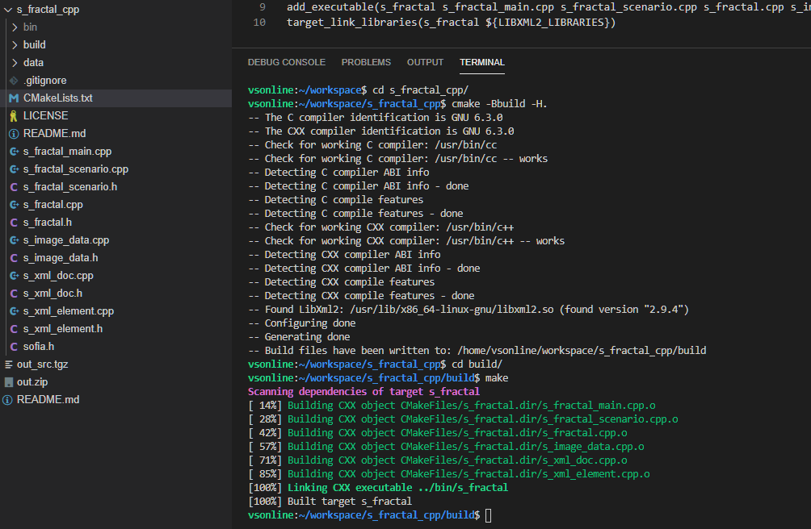

# s_fractal_cpp: C++ Mandelbrot and Julia fractals generator


s_fractal_cpp is a Mandelbrot and Julia fractals generator written in C++.

The generation parameters are specified in an XML file. The generated images are in [TGA](https://ludorg.net/amnesia/TGA_File_Format_Spec.html) format. 

Image below was generated with s_fractal_cpp.

<a href="./data/docs_img/mandelbrot12.png"></a>

## Prerequisites

In 2004, s_fractal_cpp was originally compiled on Windows XP with Visual Studio 2003, but it was portable C++.
It now just requires a WSL (Windows Subsystem for Linux) or a Linux shell with CMake and libxml2 installed.

To install WSL on Windows 10, read the [Installation Guide](https://docs.microsoft.com/en-us/windows/wsl/install-win10).

For a quick use of a Linux shell, [Visual Studio Online](https://visualstudio.microsoft.com/services/visual-studio-online/) is a perfect solution. It was used to test compilation of s_fractal_cpp.

### LibXML2 install

```bash
sudo apt-get install libxml2
```

### CMake install

```bash
sudo apt-get install cmake
```

## Compilation of s_fractal_cpp

After cloning this repo, compilation is made with cmake and make.

```bash
cmake -Bbuild -H.
cd build/
make
```

The image below is a screen capture of the compilation in a Linux shell with [Visual Studio Online](https://visualstudio.microsoft.com/services/visual-studio-online/).



## Running s_fractal_cpp

Build files and CMake files are generated in 'build' folder. A 'bin' directory is created at root level. At this same level, there is a 'data' folder with a fractal.xml file. This file contains the parameters for generation of Mandelbrot and Julia fractals. fractal.xml is the default filename used. This filename can be provided as first command line argmuent.

```bash
cd data/
../bin/s_fractal_cpp
../bin/s_fractal_cpp gen.xml
```

The image below is a screen capture of program running in [Visual Studio Online](https://visualstudio.microsoft.com/services/visual-studio-online/).


### XML configuration files for s_fractal_cpp

Hereafter an example of an XML configuration file for s_fractal_cpp.

Root Node is 'Fractal', Followed by 'Scenario' which contains a sequence of 'Image'. 'Image' contains 'Type' and 'ParamsId'. After 'Scenario' definition, 'MandelbrotParams' and 'JuliaParams' are described.

NB: XML parsing is not very robust and errors are not always detected...

```xml
<?xml version="1.0" encoding="utf-8"?>
<Fractal>
	<Scenario>
        <Image id="1">
			<Type>Mandelbrot</Type> <!-- Mandelbrot or Julia -->
			<ParamsId>1</ParamsId> <!-- id of MandelbrotParams (see below) -->
		</Image>
		<Image id="2">
			<Type>Julia</Type>
			<ParamsId>1</ParamsId> <!-- id of JuliaParams (see below) -->
		</Image>
    </Scenario>
    <MandelbrotParams id="1"> <!-- MandelbrotParams id #1 -->
		<width>600</width> <!-- output image size -->
		<height>600</height>
		<maxIterations>100</maxIterations> <!-- maxIterations is used to compute the step -->
		<minC>
			<real>0.25</real> <!-- min value for C -->
			<imag>0.25</imag>
		</minC>
		<maxC>
			<real>0.65</real> <!-- max value for C -->
			<imag>0.65</imag>
		</maxC>
		<minColor> <!-- RGB color definition -->
			<red>0</red>
			<green>64</green>
			<blue>64</blue>
		</minColor>
		<maxColor> <!-- RGB color definition -->
			<red>255</red>
			<green>225</green>
			<blue>255</blue>
		</maxColor>
		<outputFile>mandelbrot12.tga</outputFile>  <!-- output filename -->
	</MandelbrotParams>
	<JuliaParams id="1"> <!-- JuliaParams id #1 -->
		<width>150</width> <!-- output image size -->
		<height>150</height>
		<maxIterations>50</maxIterations> <!-- maxIterations is used to compute the step -->
		<minZ> <!-- min value for Z -->
			<real>-0.5</real>
			<imag>-0.5</imag>
		</minZ>
		<maxZ> <!-- max value for Z -->
			<real>0.5</real>
			<imag>0.5</imag>
		</maxZ>
		<c> <!-- value for C -->
			<real>0.5</real>
			<imag>0.5</imag>
		</c>
		<minColor> <!-- RGB color definition -->
			<red>0</red>
			<green>0</green>
			<blue>0</blue>
		</minColor>
		<maxColor> <!-- RGB color definition -->
			<red>255</red>
			<green>255</green>
			<blue>255</blue>
		</maxColor>
		<outputFile>julia23.tga</outputFile> <!-- output filename -->
	</JuliaParams>
</Fractal>
```

## Mandelbrot algorithm

A pseudo-code description of the Mandelbrot algorithm used by s_fractal_cpp is detailed hereafter.
For a complete description of Mandelbrot set, refer to the [Wikipedia article](https://en.wikipedia.org/wiki/Mandelbrot_set).

### Mandelbrot algorithm in LaTeX/Markdown format

Let $C$ a complex number.
$C$ depends on the coordinates of the pixel.

Let $Z_n$ a complex number. $Z_{n+1} = Z_n * Z_n + C$

if $\|Z_n\|$ > 2 then the color of $C$ is $f(n)$

### Mandelbrot algorithm in Github format (no inline LaTeX in Markdown)

Let  a complex number.
 depends on the coordinates of the pixel.

Let ) a complex number. 

if  > 2 then the color of  is 

## Julia algorithm

A pseudo-code description of the Julia algorithm used by s_fractal_cpp is detailed hereafter.
For a complete description of Julia set, refer to the [Wikipedia article](https://en.wikipedia.org/wiki/Julia_set).

### Julia algorithm in LaTeX/Markdown format

Let $C$ and $Z$ complex numbers.
$Z$ depends on the coordinates of the pixel.
$C$ is a constant.

if $\|Z_n\|$ > 2 then the color of $Z$ is $f(n)$

### Julia algorithm in Github format (no inline LaTeX in Markdown)

Let  and  complex numbers.
 depends on the coordinates of the pixel.
 is a constant.

if  > 2 then the color of  is )

## Some history on this old code

This code was developed in 2004 and was part of an ambitious (and immodest) side project named __Sofia__. It intended to be a way for developing knowledge.

Its immodest introduction motto was (in french):

_Dans la seconde moitié du Ve siècle avant JC, les sophistes firent profession d'enseigner la sofia, c'est à dire tout ce qui rend l'homme plus habile, plus savant, plus vertueux. Philosophes, ils étudiaient la logique, les phénomènes célestes, remettant en question les idées reçues, éveillant les intelligences._

Which is translated in:

_In the second half of the 5th century BC, sophists made a profession of teaching sofia, that is, all that  makes man more skilful, more learned, more virtuous. Philosophers, they studied logic, celestial phenomena, questioning conventional wisdom, awakening intelligences._

Unconsciously and unrelatedly, Sofia is also the name of my beloved daughter, born in 2015.

## Contact

If you want to contact me you can reach me at <ludorg@ludorg.net>.

## License

This project uses the following license: [MIT](https://github.com/Ludorg/s_automata_cpp/blob/master/LICENSE).
